# Microservices Authentication System

A Spring Boot microservices-based food ordering platform with JWT authentication, API Gateway, and Eureka service discovery.

## Tech Stack

| Technology | Version |
|---|---|
| Java | 25 |
| Spring Boot | 4.1.1 |
| Spring Cloud | 2025.1.3 |
| Spring Security | 7.1.1 |
| Spring Cloud Gateway | 5.0.3 |
| Netflix Eureka | 4.3.3 |
| JJWT (Java JWT) | 0.13.0 |
| PostgreSQL | Runtime |
| Lombok | Latest |
| Maven | 3.9+ |

## Architecture Overview

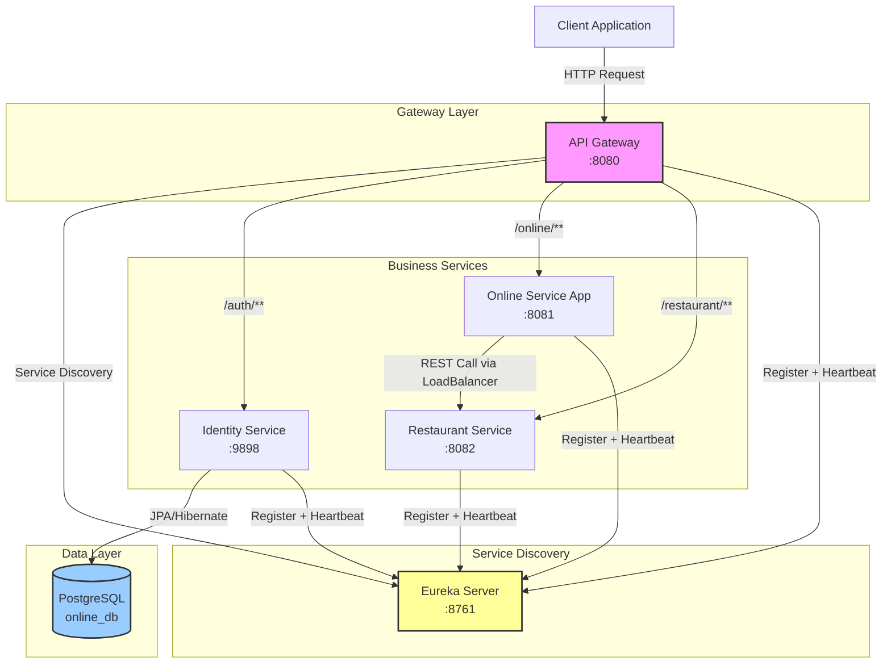

## Module Breakdown

### 1. Online Service Registry (Eureka Server)

**Port:** `8761`
**Purpose:** Central service registry where all microservices register themselves for discovery.

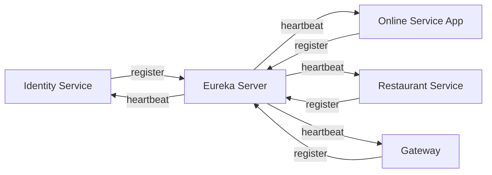

- Annotated with `@EnableEurekaServer`
- Does not register itself (`register-with-eureka: false`)
- Does not fetch registry (`fetch-registry: false`)
- Dashboard available at `http://localhost:8761`

---

### 2. Identity Service (Authentication & Authorization)

**Port:** `9898`
**Purpose:** Handles user registration, JWT token generation, and token validation.

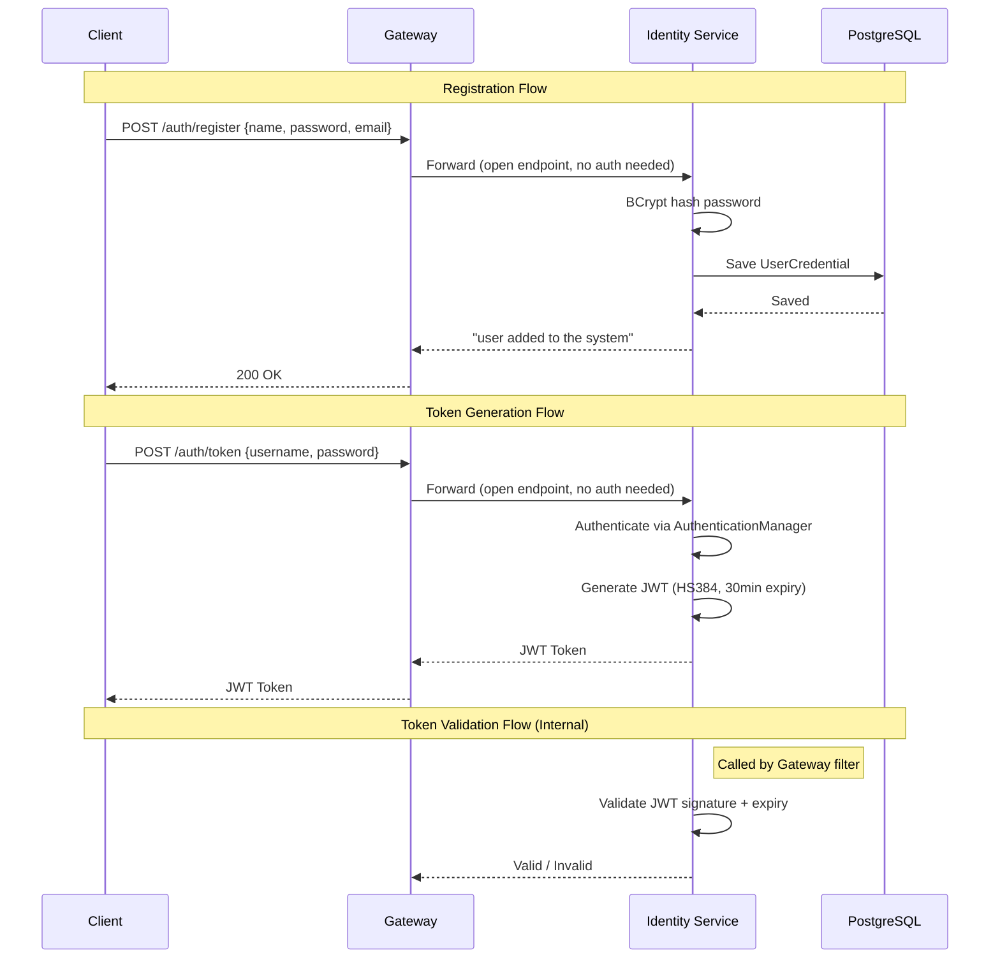

**API Endpoints:**

| Method | Endpoint | Auth Required | Description |
|---|---|---|---|
| POST | `/auth/register` | No | Register a new user |
| POST | `/auth/token` | No | Generate JWT token |
| GET | `/auth/validate?token=` | No | Validate a JWT token |

**Key Classes:**

| Class | Responsibility |
|---|---|
| `AuthController` | REST endpoints for register, token, validate |
| `AuthService` | Business logic: save user with BCrypt, delegate token ops |
| `JwtService` | JWT generation & validation using JJWT 0.13.0 API |
| `AuthConfig` | Spring Security 7.x config: STATELESS session, CSRF disabled |
| `CustomUserDetailsService` | Loads user from PostgreSQL for Spring Security |
| `CustomUserDetails` | Implements `UserDetails` with empty authorities |
| `UserCredential` | JPA entity mapped to `user_credential` table |

**Security Configuration:**

```java
http.csrf(csrf -> csrf.disable())
    .sessionManagement(session -> session.sessionCreationPolicy(SessionCreationPolicy.STATELESS))
    .authorizeHttpRequests(auth -> auth
        .requestMatchers("/auth/register", "/auth/token", "/auth/validate").permitAll()
        .anyRequest().authenticated())
```

---

### 3. Online Service App (Customer-Facing Service)

**Port:** `8081`
**Purpose:** Main application service for customers. Provides greeting and order status checking by calling the Restaurant Service.

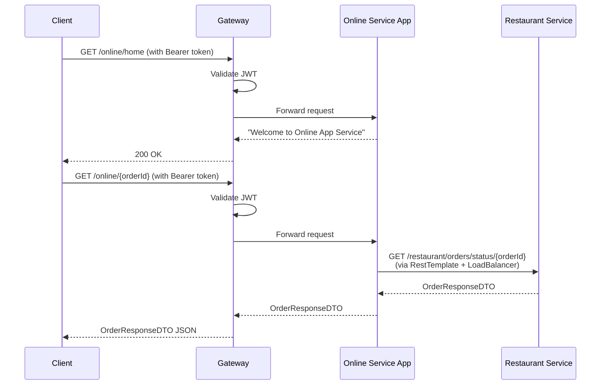

**API Endpoints:**

| Method | Endpoint | Auth Required | Description |
|---|---|---|---|
| GET | `/online/home` | Yes | Returns welcome message |
| GET | `/online/{orderId}` | Yes | Checks order status via Restaurant Service |

**Key Classes:**

| Class | Responsibility |
|---|---|
| `OnlineServiceAppController` | REST controller for customer endpoints |
| `OnlineServiceAppService` | Business logic, delegates order lookup to client |
| `RestaurantServiceClient` | Feign-style REST client using `RestTemplate` with `@LoadBalanced` |
| `OnlineServiceAppConfig` | Configures `@LoadBalanced RestTemplate` for service discovery |
| `OrderResponseDTO` | Data transfer object for order details |

**Inter-Service Communication:**

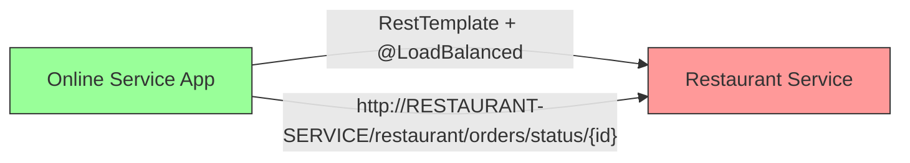

The `@LoadBalanced` annotation on `RestTemplate` enables client-side load balancing. The service name `RESTAURANT-SERVICE` is resolved via Eureka to actual host:port.

---

### 4. Restaurant Service

**Port:** `8082`
**Purpose:** Manages restaurant orders. Returns order details from an in-memory data store.

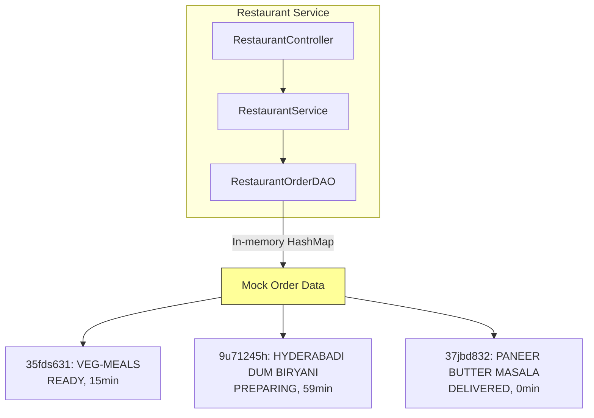

**API Endpoints:**

| Method | Endpoint | Auth Required | Description |
|---|---|---|---|
| GET | `/restaurant` | Yes (via Gateway) | Returns welcome message |
| GET | `/restaurant/orders/status/{orderId}` | Yes (via Gateway) | Returns order details |

**Key Classes:**

| Class | Responsibility |
|---|---|
| `RestaurantController` | REST controller for restaurant endpoints |
| `RestaurantService` | Business logic for order retrieval |
| `RestaurantOrderDAO` | In-memory data access with mock order data |
| `OrderResponseDTO` | Data transfer object (identical to Online Service's DTO) |

---

### 5. API Gateway

**Port:** `8080`
**Purpose:** Single entry point for all client requests. Routes requests to appropriate services, validates JWT tokens, and enforces security policies.

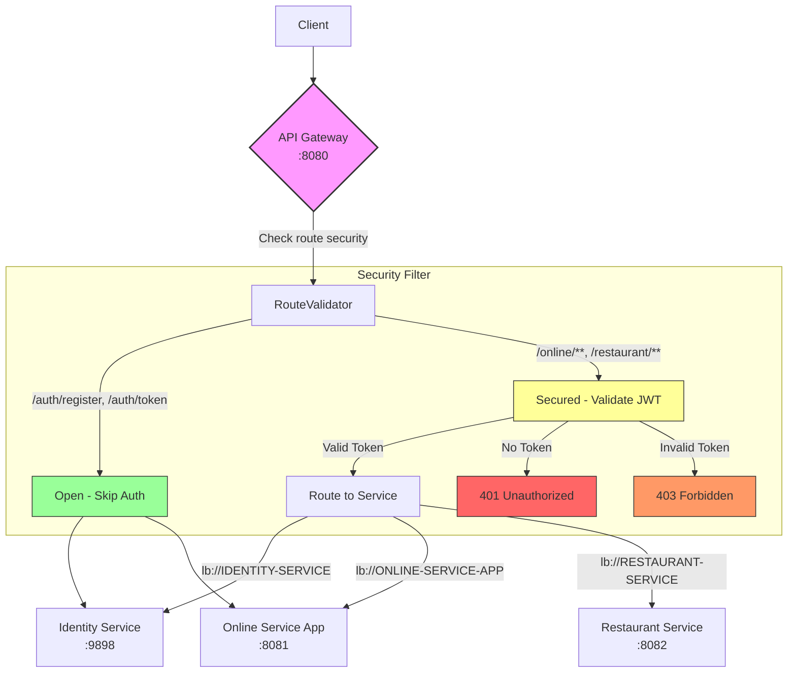

**Route Configuration (Spring Cloud Gateway 5.x format):**

```yaml
spring.cloud.gateway.server.webflux.routes:
  - id: online-service-app
    uri: lb://ONLINE-SERVICE-APP
    predicates:
      - Path=/online/**
    filters:
      - AuthenticationFilter

  - id: restaurant-service
    uri: lb://RESTAURANT-SERVICE
    predicates:
      - Path=/restaurant/**
    filters:
      - AuthenticationFilter

  - id: identity-service
    uri: lb://IDENTITY-SERVICE
    predicates:
      - Path=/auth/**
```

> **Important:** Spring Cloud Gateway 5.x (Spring Cloud 2025.0+) requires routes under `spring.cloud.gateway.server.webflux.routes`, NOT the legacy `spring.cloud.gateway.routes`.

**Security Filter Flow:**

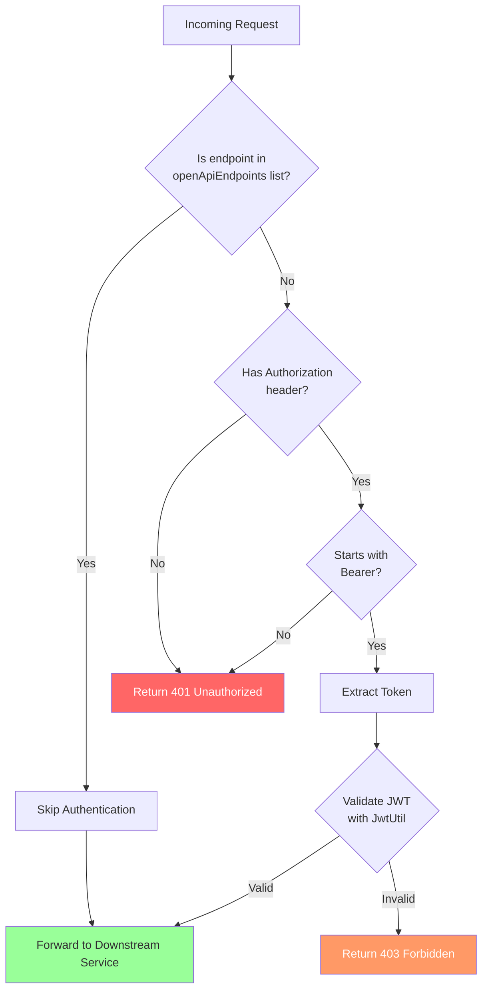

**Open Endpoints (no auth required):**
- `/auth/register`
- `/auth/token`
- `/eureka`

**Key Classes:**

| Class | Responsibility |
|---|---|
| `AuthenticationFilter` | Custom `AbstractGatewayFilterFactory` - validates JWT on secured routes |
| `RouteValidator` | Predicate that determines if a request needs authentication |
| `JwtUtil` | JWT validation using the shared secret key |
| `AppConfig` | Bean configuration |

---

## Request Flow - Complete Journey

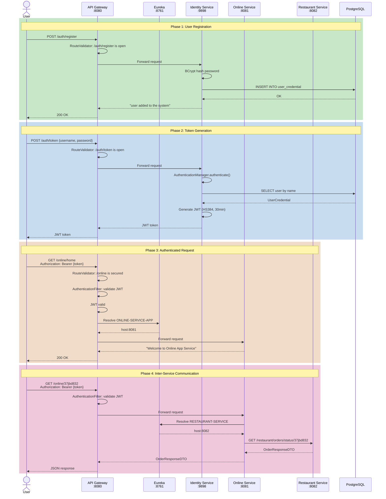

## JWT Token Flow

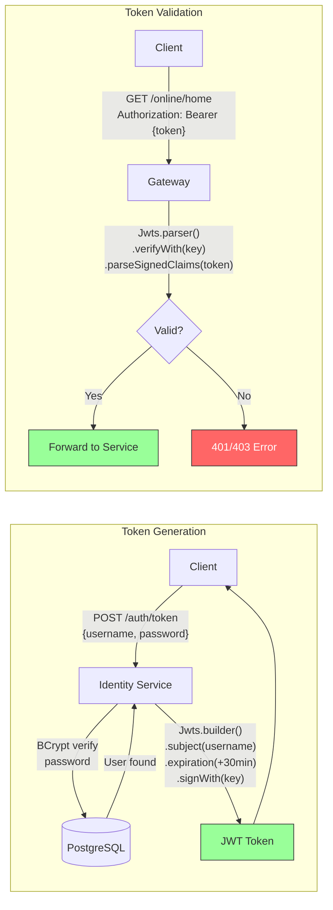

**JWT Structure:**
- **Algorithm:** HS384 (HMAC-SHA384)
- **Subject:** Username
- **Issued At:** Current timestamp
- **Expiration:** 30 minutes from issuance
- **Secret:** Shared between Identity Service and Gateway

## Database Schema

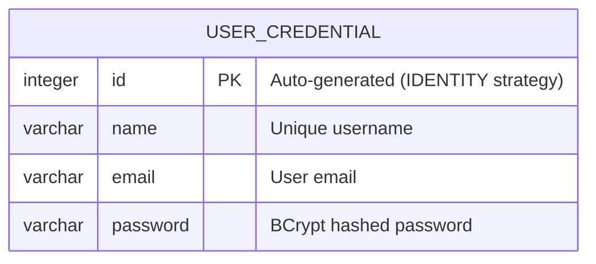

- **Database:** PostgreSQL (`online_db`)
- **DDL Strategy:** `hibernate.ddl-auto: update` (auto-creates/updates tables)
- **ORM:** Spring Data JPA with Hibernate

## Ports Summary

| Service | Port | URL |
|---|---|---|
| Eureka Server | 8761 | http://localhost:8761 |
| Identity Service | 9898 | http://localhost:9898 |
| Online Service App | 8081 | http://localhost:8081 |
| Restaurant Service | 8082 | http://localhost:8082 |
| API Gateway | 8080 | http://localhost:8080 |

## Getting Started

### Prerequisites

- Java 25
- Maven 3.9+
- PostgreSQL running on `localhost:5432`
- Database `online_db` created with user `postgres` / password `password`

### Database Setup

```sql
CREATE DATABASE online_db;
```

### Build All Modules

```bash
# From each module directory
mvn clean package -DskipTests
```

### Start Services (in order)

```bash
# 1. Eureka Server (must start first)
java -jar online-service-registry/target/online-service-registry-0.0.1-SNAPSHOT.jar

# 2. Identity Service (depends on Eureka + PostgreSQL)
java -jar identity-service/target/identity-service-0.0.1-SNAPSHOT.jar

# 3. Restaurant Service (depends on Eureka)
java -jar restaurant-service/target/restaurant-service-0.0.1-SNAPSHOT.jar

# 4. Online Service App (depends on Eureka + Restaurant Service)
java -jar online-service-app/target/online-service-app-0.0.1-SNAPSHOT.jar

# 5. API Gateway (depends on Eureka + all services)
java -jar online-service-gateway/target/online-service-gateway-0.0.1-SNAPSHOT.jar
```

### Verify Services

```bash
# Check Eureka dashboard
curl http://localhost:8761/actuator/health

# Register a user
curl -X POST http://localhost:8080/auth/register \
  -H "Content-Type: application/json" \
  -d '{"name":"testuser","password":"testpass","email":"test@gmail.com"}'

# Get JWT token
curl -X POST http://localhost:8080/auth/token \
  -H "Content-Type: application/json" \
  -d '{"username":"testuser","password":"testpass"}'

# Access protected endpoint (use token from above)
curl http://localhost:8080/online/home \
  -H "Authorization: Bearer {your-token}"

# Check order status
curl http://localhost:8080/online/37jbd832 \
  -H "Authorization: Bearer {your-token}"
```

## Docker Deployment

### Prerequisites

- Docker
- Docker Compose

### Build and Run

```bash
# Build all images and start all services
docker-compose up --build

# Run in background
docker-compose up --build -d

# Stop all services
docker-compose down

# Stop and remove volumes
docker-compose down -v
```

### Verify

```bash
# Check all containers
docker-compose ps

# Check logs
docker-compose logs -f

# Check specific service logs
docker-compose logs -f gateway
docker-compose logs -f identity-service
```

### Access Services

| Service | URL |
|---|---|
| Eureka Dashboard | http://localhost:8761 |
| API Gateway | http://localhost:8080 |
| Identity Service | http://localhost:9898 |
| Online Service App | http://localhost:8081 |
| Restaurant Service | http://localhost:8082 |

---

## Kubernetes Deployment

### Prerequisites

- Minikube or a Kubernetes cluster
- `kubectl` configured
- Docker images built locally

### Build Images for Kubernetes

```bash
# Point Docker to Minikube's daemon
eval $(minikube docker-env)

# Build all images
docker-compose build
```

### Deploy

```bash
# Apply all resources
kubectl apply -f kubernetes/

# Or apply in order
kubectl apply -f kubernetes/namespace.yaml
kubectl apply -f kubernetes/configmap.yaml
kubectl apply -f kubernetes/secret.yaml
kubectl apply -f kubernetes/postgres.yaml
kubectl apply -f kubernetes/eureka-server.yaml
kubectl apply -f kubernetes/identity-service.yaml
kubectl apply -f kubernetes/gateway.yaml
kubectl apply -f kubernetes/online-service-app.yaml
kubectl apply -f kubernetes/restaurant-service.yaml
```

### Verify Deployment

```bash
# Check pods
kubectl get pods -n microservices-auth

# Check services
kubectl get svc -n microservices-auth

# Check logs
kubectl logs -f deployment/gateway -n microservices-auth
kubectl logs -f deployment/identity-service -n microservices-auth
```

### Access Services via Minikube

```bash
# Get gateway NodePort
minikube service gateway-service -n microservices-auth --url

# Or use port-forward
kubectl port-forward svc/gateway-service 8080:8080 -n microservices-auth
```

### Cleanup

```bash
# Delete all resources
kubectl delete namespace microservices-auth
```

---

## Migration Notes (Spring Boot 4.x / Spring Cloud 2025.x)

This project uses the latest Spring Boot and Spring Cloud versions which include several breaking changes from previous versions:

| Change | Old | New |
|---|---|---|
| Gateway config prefix | `spring.cloud.gateway.routes` | `spring.cloud.gateway.server.webflux.routes` |
| Gateway artifact | `spring-cloud-starter-gateway` | `spring-cloud-starter-gateway-server-webflux` |
| Gateway module | `spring-cloud-gateway-server` | `spring-cloud-gateway-server-webflux` |
| Jackson null-to-primitive | `FAIL_ON_NULL_FOR_PRIMITIVES: false` | `FAIL_ON_NULL_FOR_PRIMITIVES: true` (now rejects `null` → `int`) |
| `UserDetails.getAuthorities()` | Allowed `null` return | Requires non-null `Collection` (use `Collections.emptyList()`) |
| `HttpHeaders.containsKey()` | Available | Removed; use `getFirst()` instead |
| `DaoAuthenticationProvider` | 2-arg constructor | 1-arg constructor only; use `setPasswordEncoder()` setter |
| Session management | Default session creation | Explicit `SessionCreationPolicy.STATELESS` required for REST APIs |

## Project Structure

```
microservices-auth/
├── docker-compose.yml
├── kubernetes/
│   ├── namespace.yaml
│   ├── configmap.yaml
│   ├── secret.yaml
│   ├── postgres.yaml
│   ├── eureka-server.yaml
│   ├── identity-service.yaml
│   ├── gateway.yaml
│   ├── online-service-app.yaml
│   └── restaurant-service.yaml
│
├── identity-service/
│   ├── Dockerfile
│   ├── .dockerignore
│   └── src/main/java/com/auth/microservice/
│       ├── IdentityServiceApplication.java
│       ├── config/
│       │   ├── AuthConfig.java
│       │   ├── CustomUserDetails.java
│       │   └── CustomUserDetailsService.java
│       ├── controller/
│       │   └── AuthController.java
│       ├── dto/
│       │   └── AuthRequest.java
│       ├── entity/
│       │   └── UserCredential.java
│       ├── repository/
│       │   └── UserCredentialRepository.java
│       └── service/
│           ├── AuthService.java
│           └── JwtService.java
│
├── online-service-app/
│   ├── Dockerfile
│   ├── .dockerignore
│   └── src/main/java/com/auth/microservice/
│       ├── OnlineServiceAppApplication.java
│       ├── client/
│       │   └── RestaurantServiceClient.java
│       ├── config/
│       │   └── OnlineServiceAppConfig.java
│       ├── controller/
│       │   └── OnlineServiceAppController.java
│       ├── dto/
│       │   └── OrderResponseDTO.java
│       └── service/
│           └── OnlineServiceAppService.java
│
├── online-service-gateway/
│   ├── Dockerfile
│   ├── .dockerignore
│   └── src/main/java/com/auth/microservice/online_service_gateway/
│       ├── OnlineServiceGatewayApplication.java
│       ├── config/
│       │   └── AppConfig.java
│       ├── filter/
│       │   ├── AuthenticationFilter.java
│       │   └── RouteValidator.java
│       └── util/
│           └── JwtUtil.java
│
├── online-service-registry/
│   ├── Dockerfile
│   ├── .dockerignore
│   └── src/main/java/com/auth/microservice/
│       └── OnlineServiceRegistryApplication.java
│
└── restaurant-service/
    ├── Dockerfile
    ├── .dockerignore
    └── src/main/java/com/auth/microservice/
        ├── RestaurantServiceApplication.java
        ├── controller/
        │   └── RestaurantController.java
        ├── dao/
        │   └── RestaurantOrderDAO.java
        ├── dto/
        │   └── OrderResponseDTO.java
        └── service/
            └── RestaurantService.java
```

## License

This project is for educational purposes.
